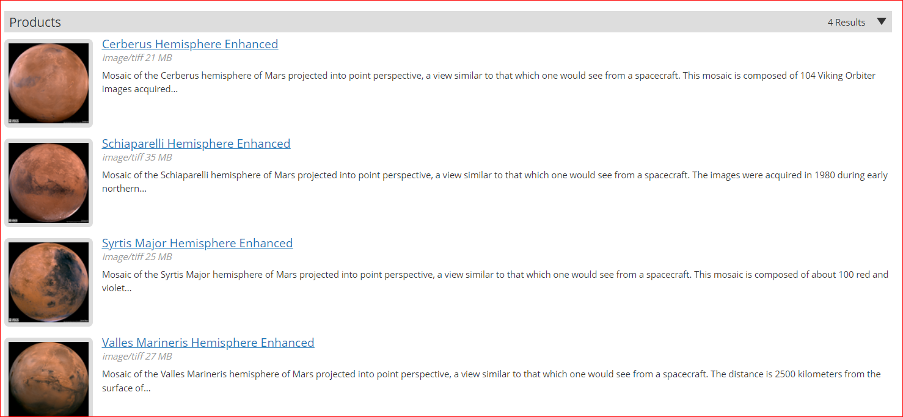
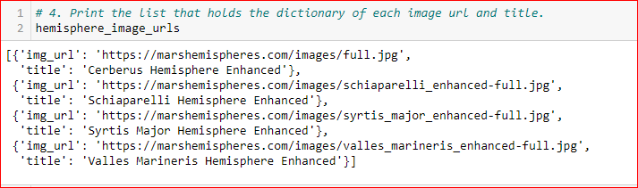
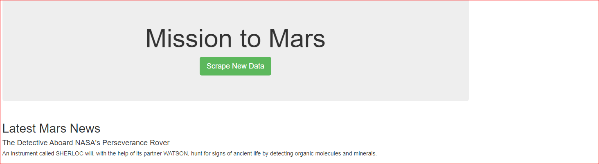
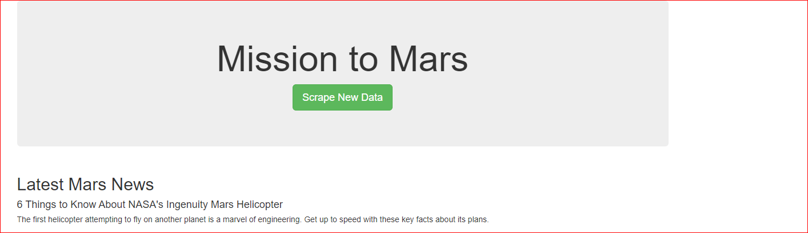
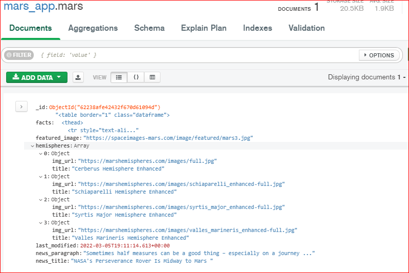
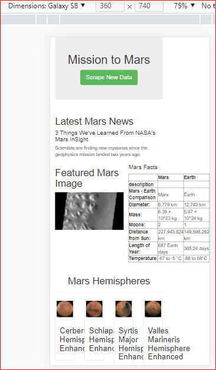
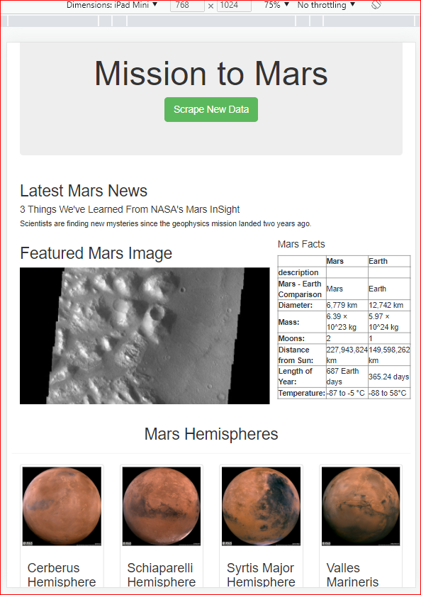
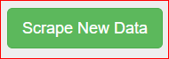
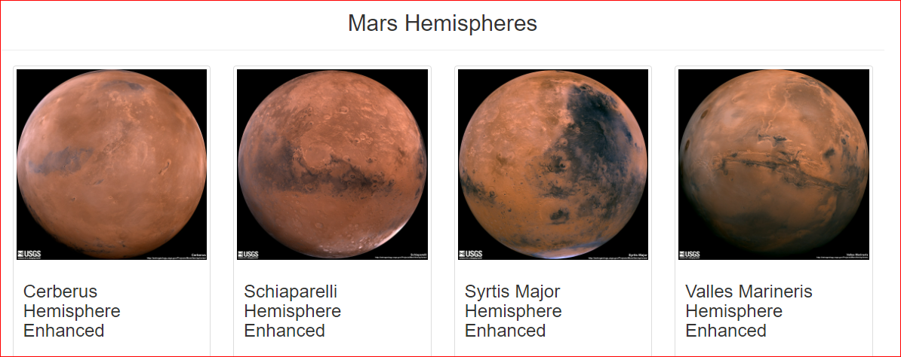

# Mission-to-Mars
The main purpose of this challenge is to automate teh web browser visit different website to extract data to analyse.  We used the following website to collect our datas to analyse:
* redplanetsscience.com
* spaceimages-mars.com
* galaxyfacts-mars.com
* marshemispheres.com

## Scrape Full-Resolution Mars Hemisphere Images and Titles:

* Using the beautifulSoup & Splinter , scraped the full resoultion images of Mar's hemisphere & titles of those images ( from Mar's Hemisphere website)
* Used the DevTools to inspect the page to scrape the proper image & title.
* Stored the full images & title in list of directories

## Update the Web App with Mars’s Hemisphere Images and Titles:
* Updated the scraping file to include function hemispheres.
* Modified the data in the scrape_all function to include the list of directory of the url & titles of the images.
* Mongo daabase was updated to contain the url & titles of the

Before Scraping:

After Scraping:

### The latest Mars News got updated after scraping!
 The updated mongo database after scraping:
 

 ## Added Bootstrap components & modified code for mobile friendly:
 ### Mobile responsive website:
 * Updated the index.html file to make the website mobile/tablet/desktop responsive.

 Screen shot of the website for Galaxy:

 

 Screen shot of the website for iPad:

 

 ### Bootstrap Components
 * Changed the color of the bitton for scraping to green (SUCCESS!)
 

* Changed the images of teh Mar's hemisphere to display in thumbnail.

